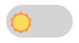

# Dark Mode Toggle Component

The Dark Mode Toggle Component is a lightweight, easy-to-integrate custom element that allows users to switch between dark and light themes on your website. It's designed to be incredibly simple to use, requiring just a single line of HTML to add to your project. This component automatically adds a `.dark` class to the document's root element, enabling seamless theme transitions. It's perfect for projects that aim to provide a user-friendly theme toggling experience with minimal effort.




## Features

- **Automatic Theme Detection**: Initializes based on the user's system preference for dark or light mode. Stores their preference in local storage.
- **Easy to Use**: Simply add the component to your project, and it handles the rest.
- **Customizable**: Integrates with your project's styles.
- **Lightweight**: Less than 2kB gzipped, making it an incredibly efficient choice for any project.
- **Toggling images**: Images can be toggled with this component as well. Just add `dark-toggle` to their id and `data-alt-src="path/to/dark/mode.png` and it just works!

## Getting Started

To use the Dark Mode Toggle Component in your project, you only need to include the script from jsDelivr CDN. Here's how you can do it:

### Include the Script

Add the following `<script>` tag to your HTML document, ideally within the `<head>` section to ensure it loads early:

```html
<script src="https://cdn.jsdelivr.net/npm/dark-mode-toggle-component@latest/dist/index.js"></script>
```

You can also install the package through npm and add it to your project that way, the choice is yours.

**Note**: It's important you import it at the top of `<head>` as a regular, non-deferred script in order to ensure there is no flashing of unstyled content. The reason is that if a user sets their preference on your website to dark mode but their system preference is light they would first see a flash of light mode followed by dark mode.

### Usage

Once included, you can use the `<dark-mode-toggle>` element anywhere in your HTML document:

```html
<dark-mode-toggle></dark-mode-toggle>
```

That's it! The component will automatically render a toggle switch that allows users to switch between dark and light modes.

## Example

The component modifies the document by adding or removing the `.dark` class on the root element. You can define your theme styles using CSS variables in the `:root` and `.dark` selectors.

Here's an example of how you can define your CSS variables for light and dark themes:

```css
:root {
  --background-color: #ffffff;
  --text-color: #000000;
}

.dark {
  --background-color: #1a1a1a;
  --text-color: #ffffff;
}

body {
  background-color: var(--background-color);
  color: var(--text-color);
}
```

These examples demonstrate how the component looks in different themes. You can style the component and the themed elements of your site using CSS as shown above.

For images the following works:

```html

```

If you're using a bundler like rollup you may need to change `data-alt-src` to `project/images/image` as shown above because it may not be rewritten.
